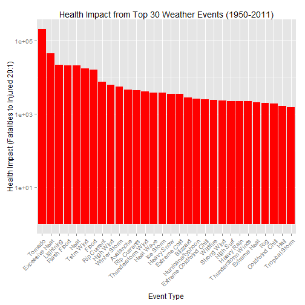
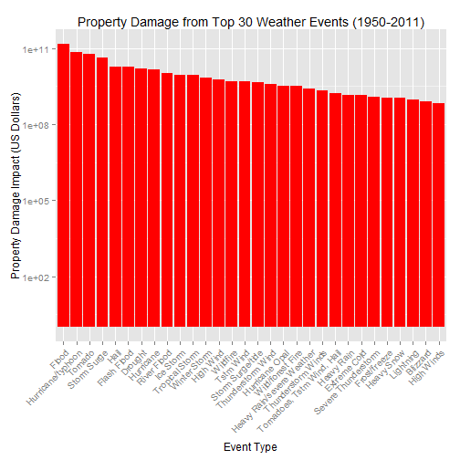

## Synopsis

Severe weather events can signficantly impact local and regional economies, cause loss of property, health and life. The number, severity, location and type of events is such that government resources simply can't fully respond to each event. This study of severe event data will list the events that have cause the most loss of life, greatest injury, and highest property damage.

Between the years 1950 and 2011, the greatest threat to life and limb is tornados. During the same time period floods were the greatest cause of property loss.

This analysis fulfills the requirements of Reproducible Research class taught by Dr. Roger Peng and offered through Coursera.

## Data Processing

We used a fair amount of libraries to complete this task.


```r
library(R.utils)
library(data.table)
library(lubridate)
library(plyr)
library(ggplot2)
library(reports)
```


### Getting and Loading the Data

We got the data from the URL supplied by the instructor, downloaded it, uncompressed it and loaded it in using data.table since that is very fast for reading and data manipulation.


```r
if(!file.exists("./data")) {
    dir.create("./data")
}
if(!file.exists("./data/StormData.csv.bz2") & !file.exists("./data/StormData.csv")) {
    download.file("https://d396qusza40orc.cloudfront.net/repdata%2Fdata%2FStormData.csv.bz2",
                  "./data/StormData.csv.bz2",
                  method = "curl")
    if(!file.exists("./data/StormData.csv")) {
        bunzip2("./data/StormData.csv.bz2")
    }
}
if(!file.exists("./data/NWS_Doc.pdf")) {
    download.file("https://d396qusza40orc.cloudfront.net/repdata%2Fpeer2_doc%2Fpd01016005curr.pdf",
                  "./data/NWS_Doc.pdf",
                  method = "curl")
}
if(!file.exists("./data/NWS_FAQ.pdf")) {
    download.file("https://d396qusza40orc.cloudfront.net/repdata%2Fpeer2_doc%2FNCDC%20Storm%20Events-FAQ%20Page.pdf",
                  "./data/NWS_FAQ.pdf",
                  method = "curl")
}

# We want to use fread to create a data.table but first we
# need to read the file in using read.csv and then subset and write out the subset
if(!file.exists("./data/StormDamage.csv")) {
    data <- read.csv("./data/StormData.csv")
    data <- data[, c("BGN_DATE",
                     "EVTYPE",
                     "FATALITIES",
                     "INJURIES",
                     "PROPDMG",
                     "PROPDMGEXP",
                     "CROPDMG",
                     "CROPDMGEXP")]
    write.csv(data,
              "./data/StormDamage.csv",
              row.names = FALSE)
    rm(data)
}

# Step 2 - Load in the data
data <- fread("./data/StormDamage.csv")

# Lets make all of the column names lowercase
setnames(data, colnames(data), tolower(colnames(data)))
```

### Preliminary Data Analysis

We did a couple of quick checks to see how the data looked.


```r
# How many different property damage exponents do we have?
unique(data$propdmgexp)
```

```
##  [1] "K" "M" ""  "B" "m" "+" "0" "5" "6" "?" "4" "2" "3" "h" "7" "H" "-"
## [18] "1" "8"
```

```r
# We have 19 of them some seem to be a power of ten and 
# most of the rest of them can be made into powers of ten
# Here is how it is distributed
table(data$propdmgexp)
```

```
## 
##             -      ?      +      0      1      2      3      4      5 
## 465934      1      8      5    216     25     13      4      4     28 
##      6      7      8      B      h      H      K      m      M 
##      4      5      1     40      1      6 424665      7  11330
```

```r
# How Many different crop damage exponents do we have?
unique(data$cropdmgexp)
```

```
## [1] ""  "M" "K" "m" "B" "?" "0" "k" "2"
```

```r
# It looks like we have 9 of a similar character to the
# property damage exponents
# Here is how that is distributed
table(data$cropdmgexp)
```

```
## 
##             ?      0      2      B      k      K      m      M 
## 618413      7     19      1      9     21 281832      1   1994
```

```r
#How many types of event do we have
length(unique(data$evtype))
```

```
## [1] 985
```


Basically, we needed to clean up the scaling factors for the damage estimates and it looks like we will need to clean up the event type data a little bit as there shouldn't be 985 different types.

### Normalizing and Tidying Up the Data

We fixed the beginning date to a date field and we also weighted the health data to give a premium to fatalities at a 20:1 ratio. I got that weighting from the National Security Council estimates on dollar damages between fatalities and disabling injuries in car accidents.


```r
# Let's just add some additional columns to include year,
# a health impact ranking, and a total damage amount
#data[, year := year(bgn_date)]

# In order to develop a health impact score I weighted
# the fatalities 20 times more impactful than an injury.
# A report from the National Safety Council describes the cost impact
# of auto accidents. 
# Source: http://www.nsc.org/news_resources/injury_and_death_statistics/Pages/EstimatingtheCostsofUnintentionalInjuries.aspx
# The average financial impact of a fatality was $1,410,000 vs $78,900 for a disabling injury.
# That's roughly a 20:1 financial impact so I went with that for my scoring.
data[, health := fatalities * 20 + injuries]
```

Next we needed to scale the property and crop damage amounts to dollar figures from the related two fields per damage estimate.


```r
# This will normalize damage estimate and exponent
scaleData <- function(mantissa, exponent) {
    if(suppressWarnings(!is.na(as.numeric(exponent))))
    {
        expn = as.numeric(exponent)
    } else {
        expn <- switch(exponent,
                       H = , h = 2,
                       K = , k = 3,
                       M = , m = 6,
                       B = , b = 9,
                       0)
    }
    return(mantissa * 10^expn)
}
scaleDataVector = Vectorize(scaleData)

# Now create a damage score that combines property and crop damage
data[, damage := scaleDataVector(propdmg, propdmgexp) + scaleDataVector(cropdmg, cropdmgexp)]
```

Finally we needed to fix the event type data so that it would be reduce from 985 events to just a few dozen and have those event names in Title Case (with summary type events removed since they are summaries).


```r
# The event type data is a mess. Let's create a new field that we can fix up as we have time
suppressWarnings(data[, eventType := CA(evtype)]) # All events are now in Title case.

# Lets Remove Summary Events
data <- data[!grepl("^Summary", data$eventType, ignore.case = TRUE), ]
```

## Results

### Severe Weather Events Ranked by Health Impact
We weighted fatalities quite a bit heavier than injuries at a premium of 20:1. This is a guess but see the data processing section for rational. Tornados were by far the highest impact event healthwise. We took the top 30 events and scaled them log10 in order to show rank rather than weight.


```r
healthImpact <- aggregate(health ~ eventType, data, sum)
healthImpact <- arrange(healthImpact, desc(health))
healthImpact$eventType <- factor(healthImpact$eventType, healthImpact$eventType) # Make plot by impact
healthImpact <- head(healthImpact, 30)

ggplot(data = healthImpact,
       aes(x = eventType, y = health )) + 
    geom_bar(stat = "identity", fill = "red") + 
    theme(axis.text.x = element_text(angle = 45, hjust = 1)) + 
    scale_y_log10(expand = waiver()) +
    ylab("Health Impact (Fatalities to Injured 20:1)") + 
    xlab("Event Type") + 
    ggtitle("Health Impact from Top 30 Weather Events (1950-2011)")
```

 

### Severe Weather Events Ranked by Property Loss
For property and crop damage estimates we simply added the effects. Floods were far and away the biggest impact. As for the health impact we scaled the results log10 in order to show rank rather than weight of the impact.


```r
damageImpact <- aggregate(damage ~ eventType, data, sum)
damageImpact <- arrange(damageImpact, desc(damage))
damageImpact$eventType <- factor(damageImpact$eventType, damageImpact$eventType) # Make plot by impact
damageImpact <- head(damageImpact, 30)

ggplot(data = damageImpact,
       aes(x = eventType, y = damage )) + 
    geom_bar(stat = "identity", fill = "red") + 
    theme(axis.text.x = element_text(angle = 45, hjust = 1)) + 
    scale_y_log10(expand = waiver()) +
    ylab("Property Damage Impact (US Dollars)") + 
    xlab("Event Type") + 
    ggtitle("Property Damage from Top 30 Weather Events (1950-2011)")
```

 


